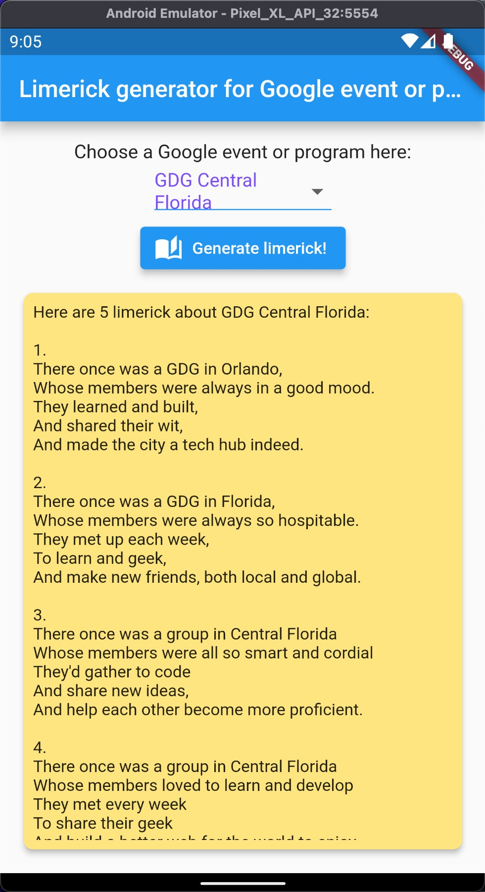

# Limerick Generator

This is a demo app for generating limericks using AI.

## Description

The Limerick Generator is a Flutter project that uses the Google PaLM API AI to generate limericks. It provides a simple interface for users to generate limericks based on their selection.

## Features

- Generate limericks based on user selection
- Easy-to-use interface

## Installation

1. Clone this repository.
2. Open the project in your preferred IDE.
3. rename .env.example file to .env and add your PaLM API KEY
4. Run the app on your device or emulator.

## Usage

1. Launch the app on your device.
2. Select from the list an event or program.
3. Tap the "Generate limerick" button to generate a limerick.
4. View a list of generated limericks on the screen.

## Screenshots

## Contributing

Contributions are welcome! If you find any bugs or have suggestions for improvements, please open an issue or submit a pull request.

## License

This project is licensed under the [MIT License](https://opensource.org/licenses/MIT).
